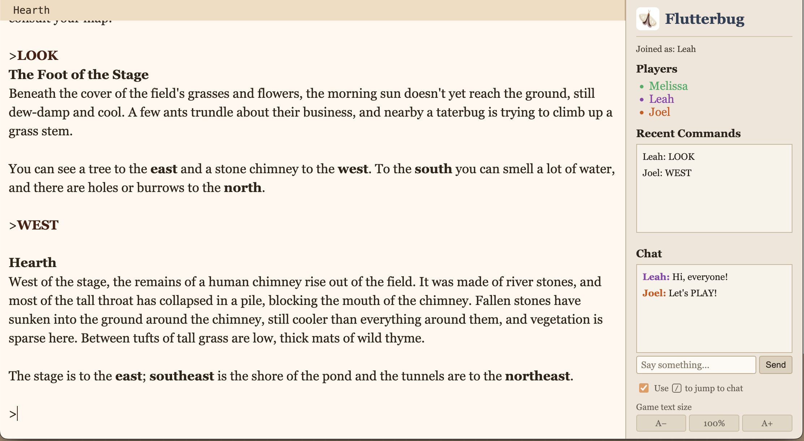

# Flutterbug

Flutterbug is a project that lets you play parser-style Interactive Fiction
games collaboratively with one or more friends online.



It can play:

- ZMachine games (such as Infocom games)
- Glulx games
- TADS
- Hugo
- Scare

## On Windows? Start here

Grab the **flutterbug-windows.zip** from the
[latest release](https://github.com/joelburton/flutterbug/releases/latest)
and follow the included `readme.txt` (also viewable in
[`windows/readme.txt`](windows/readme.txt)). It walks you through Python
+ Node.js + a one-click install batch file, and gives you drag-and-drop
launchers for solo and friends-online play.

The rest of this file is for people who want to develop on Flutterbug,
are running into trouble the Windows quick-start didn't cover, or just
want to learn more about how it works.

## Requirements

- Python
- Node

You may have these already; if not, you can get both from your OS package system.

- **MacOS**: `brew install node python`
- **Linux**: use the installer for your distro
- **Windows**: `winget install OpenJS.NodeJS.LTS Python.Python.3.12`

(closing your terminal window and re-opening may be required after you do this)

## Installing

This installs "emglken", which comes with a bunch of IF virtual machines.
Pin to 0.6.0 — the latest 0.7+ releases have a Windows bug that prevents
the interpreter from launching:

```sh
npm install -g emglken@0.6.0
```

Install Flutterbug. The `@v0.95` pins to a known release; bump it when a
newer tag is available on GitHub:

```sh
pip install --user git+https://github.com/joelburton/flutterbug.git@v0.95
```

(when this hits version 1.0, I'll add it to PyPi so this is easier to install)

## Authentication: pick a password (or explicitly opt out)

Every flutterbug invocation must pick one of:

- `--password "super secret"` — friends will be prompted for this
  password on the sign-in page. **Recommended whenever the server is
  reachable from outside your machine** (any tunnel, port-forward, LAN,
  VPN, etc).
- `--no-password` — anyone who reaches the URL can sign in. Only safe
  on a fully trusted local network. Don't combine with `--tunnel` or
  `--cloudflare` unless you genuinely intend a public game.

Forgetting to pick will fail loudly rather than quietly exposing the
server.

## Playing solo

```sh
flutterbug --no-password --open --story=MyGameFile.z5
```

(or .z8 or .zblorb or .ulx or .t3 or whatever)

`--open` waits for the server to come up on http://localhost:4000/ and
opens it in your default browser.

## Playing with friends (public tunnel)

In order for your friends to connect to your game, you'll need to open a
"tunnel" to the server on your computer. Flutterbug out of the box supports
[Localhost.run](https://localhost.run) tunnels. These are free and require
nothing else installed on your computer.

```sh
flutterbug --password "super secret" --open --tunnel --story=MyGameFile.z5
```

After a moment, this will open your browser to the same link you can send to
friends — together with the password.

Quitting Flutterbug will disconnect that tunnel.

> ⚠️ **About save files in your launch directory.** Anyone who signs in
> can issue `save` and `restore` commands that read and write
> `*.glksave` files in the directory you started flutterbug from. They
> can also overwrite each others' saves, and the sign-in page lists the
> save filenames in that directory to anyone who's signed in. Launch
> flutterbug from a clean per-game directory, not from your home directory
> or any any directory containing valuable data.

## Other options

The `--help` command will show other options, including selecting a different
port than 4000, and emitting more debugging-style log messages.

### Display mode: `--mode=flex` (default) or `--mode=fixed`

Most games work best in the default **flex** mode. Each player can use
whatever browser window size they prefer and pick their own font size,
and the game text reflows to fit. Use this for almost everything —
classic Infocom-style games, most modern parser IF, anything where the
game is just "status bar on top, story text below".

Switch to **fixed** mode for games with carefully designed window
layouts — multiple text panes side-by-side, fixed-width art or maps,
puzzle games where the geometry of the screen matters. In fixed mode,
the first player to connect (the "host") sets the window size for
everyone, so the layout looks identical on every screen. Players whose
browser is smaller than the host's will see the edges clipped; players
with bigger windows will see empty space around the game.

```sh
flutterbug --mode=fixed --password "super secret" --open --story=FancyGame.gblorb
```

### Keeping users signed in across restarts: `--secret`

By default, Flutterbug generates a random session key each time it starts.
This means that if you restart the server — to update the game file, change
a setting, or recover from a crash — everyone will need to sign in again.

To avoid this, pass a fixed secret:

```sh
flutterbug --secret "some long random string" --password "super secret" ...
```

With a consistent `--secret`, a returning user whose browser still holds a
valid session cookie is let straight into the game without seeing the sign-in
page — even if a password is required for new visitors. Pick any long random
string and keep it the same across invocations. Don't reuse it as your game
password.

### Other tunneling options

You can use Cloudflare tunneling rather than Localhost.run. To do so, you'll
need to install `cloudflared` on your computer. You don't need a Cloudflare
account. Cloudflare may scale better for larger friend groups:

```sh
flutterbug --password "super secret" --cloudflare --open --story=MyGameFile.z5
```

### How `--open` interacts with tunnels

When `--open` is combined with either tunnel flag, Flutterbug waits for
the public DNS record to be live before opening the browser. This works
around a Safari/macOS quirk where the *first* failed DNS lookup gets
cached as NXDOMAIN, and the page keeps showing "can't find the server"
even after the tunnel is up. If the tunnel doesn't come up within 30
seconds, Flutterbug exits with a non-zero status instead of opening
anything.


## Credits

Flutterbug is written by Joel Burton <joel@joelburton.com>.

It is based heavily on the remote-if-demo script by Andrew Plotkin, as well as his
GlkOte library.
